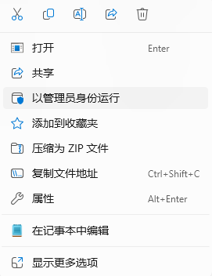
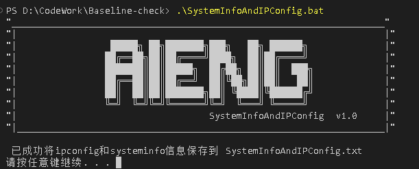

# Baseline-check
此项目为`Windows`、`Linux`等的基线检查工具
目前只开发了`Windows`端的，后续将开发`Linux`端...

**windows基线检查脚本：**
使用powershell运行`.\windowsBaselineCheck.ps1`
    

    运行报错解决!
    powershell输入set-ExecutionPolicy Unrestricted  键入：Y
    
    重新运行.\windowsBaselineCheck.ps1

# SystemInfoAndIPConfig  v1.0
`SystemInfoAndIPConfig.bat`工具用于检查终端系统信息和IP信息
此工具采用bat命令编写，运行推荐采用以管理员方式运行

或者直接在powershell中运行

| 工具清单                  |                  |                       |
| -------------------------| ---------------- | --------------------- |
| 工具名                    | 功能             | 运行                  |
| windowsBaselineCheck.ps1  | windows基线检查  | `powershell`          |
| SystemInfoAndIPConfig.bat | windows系统信息及IP检查 | `cmd`或者`powershell` |
|                           |                  |                       |
|                           |                  |                       |

注意：config.cfg、WindowsResult.txt和SystemInfoAndIPConfig.txt是运行程序后自动生成的